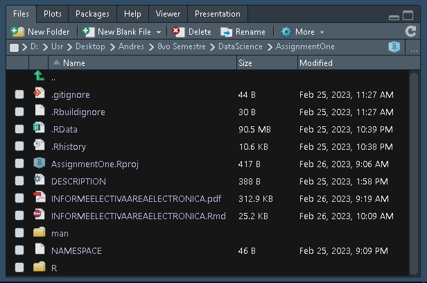
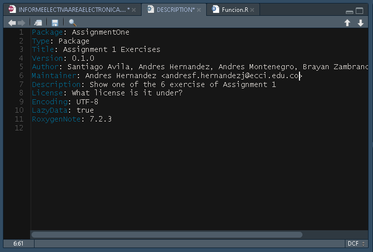
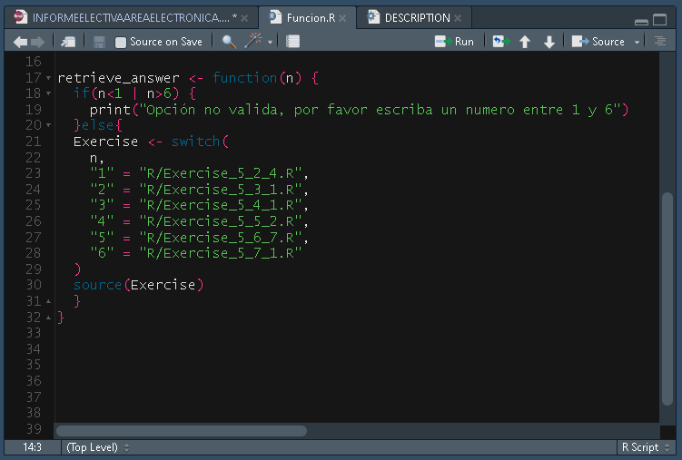
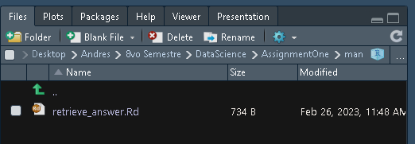
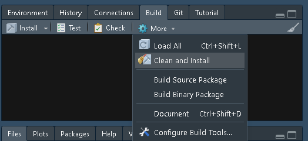
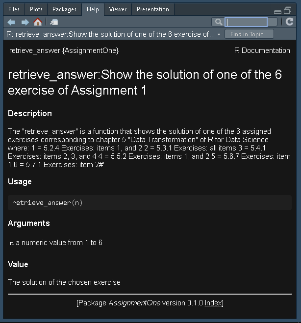

```{r setup, include=FALSE}
knitr::opts_chunk$set(echo = TRUE)
```

## INFORME - ELECTIVA AREA ELECTRONICA

*El link al repositorio público de Github es el siguiente: https://github.com/AndresFHernandezJ/AssignmentOne*

## 1. Código básico en R

### Números primos del 1 al 100

A través del siguiente código se muestran los números primos del 1 al 100.

```{r eval=FALSE}
for (i in 2:100) {
  x <- 0
  for (j in 1:i) {
    if (i %% j == 0) {
      x <- x + 1
    } else{
      
    }
  }
  if (x <= 2) {
    print(i)
  }
}
```

Obteniendo como resultado lo siguiente.

```{r echo=FALSE}
for (i in 2:100) {
  x <- 0
  for (j in 1:i) {
    if (i %% j == 0) {
      x <- x + 1
    } else{
      
    }
  }
  if (x <= 2) {
    print(i)
  }
}
```

###Chunk options 1


Notese que el siguiente mensaje es debido a que el chunk de activación de la librería de tidyverse tiene como TRUE el valor para message, debido a esto se muestra el mensaje de carga de librería en el documento.

```{r echo=FALSE, message=TRUE, warning=FALSE}
library(tidyverse)
library(nycflights13)
```

## 2. Uso básico de Tidyverse

### 5.2.4.1 Ejercicios (filter())

A continuación se presentan los ejercicios básicos para la utilización de la función filter().

***Item 1:*** Tuvieron un retraso de llegada de dos o mas horas:

```{r}
Arrival_Delay <- flights %>%
  filter(arr_delay >= 120)
View(Arrival_Delay)
```

Lo que genera la tabla flights únicamente con los vuelos con un retraso de llegada mayor a 120 minutos.

***Item 2:*** Volaron a Houston:

```{r}
Houston_destiny <- flights %>%
  filter(dest == "HOU" | dest == "IAH")
view(Houston_destiny)
```

Este código muestra los vuelos con destino a Houston determinado por "HOU" o "IAH".

***Item 3:*** Fueron operados por United, American o Delta:

```{r}
Operated_by <- flights %>% 
  filter(carrier %in% c("UA", "AA", "DL"))
view(Operated_by)
```

Se filtran y muestran los vuelos correspondientes a las operaciones de las 3 aerolineas mencionadas.

***Item 4:*** Vuelos que salieron en verano:

```{r}
Summer_dep <- flights %>% 
  filter(month >= 7 & month <= 9)
view(Summer_dep)
```

En este apartado se filtran los vuelos que fueron operados en los 3 meses correspondientes a verano, los cuales son Julio, Agosto y Septiembre.

***Item 5:*** Llegaron mas de dos horas tarde pero no partieron con retraso:

```{r}
LateArr_timeLeft <- flights %>% 
  filter(arr_delay > 120 & dep_delay <= 0)
view(LateArr_timeLeft)
```

Se filtran dos variables diferentes siendo el retraso en la llegada superior a 2 horas y el retraso en la salida inferior a 0, es decir que salieron a tiempo o mucho antes del horario establecido.

***Item 6:*** Fueron retrasados por lo menos por una hora, pero recuperaron mas de 30min en vuelo:

```{r}
Delayed1H <- flights %>% 
  filter(dep_delay >= 60 &  dep_delay - arr_delay > 30)
view(Delayed1H)
```

Se muestran los vuelos que tuvieron un retraso en la salida de al menos una hora, pero que recuperaron al menos 30min de retraso durante el vuelo, por ello se hace la resta entre ambos retrasos y debería dar superior a los 30.

***Item 7:*** Salieron entre la medianoche y las 6 de la mañana:

```{r}
Midnight_to_6am <- flights %>% 
  filter(dep_time >=0 & dep_time <= 600)
view(Midnight_to_6am)
```

Igualmente se filtran los vuelos con salidas entre la medianoche (0) y las 6am (600).

### 5.2.4.2 Ejercicios (filter() + between())

A continuación se presentan los ejercicios anteriores utilizando la funcion between().

```{r echo=FALSE, message=FALSE, warning=FALSE}
library(tidyverse)
library(nycflights13)
```

***Item 1:*** Tuvieron un retraso de llegada de dos o mas horas:

```{r}
Arrival_Delay2 <- flights %>%
  filter(between(arr_delay, 120, Inf))
View(Arrival_Delay2)
```

***Item 2:*** Volaron a Houston:

```{r}
Houston_destiny2 <- flights %>%
  filter(between(dest, "HOU","IAH"))
view(Houston_destiny2)
```

***Item 3:*** Fueron operados por United, American o Delta (No es posible utilizar between ya que se analizan 3 valores de la variable carrier):

```{r}
Operated_by <- flights %>% 
  filter(carrier %in% c("UA", "AA", "DL"))
view(Operated_by)
```

***Item 4:*** Vuelos que salieron en verano:

```{r}
Summer_dep2 <- flights %>% 
  filter(between(month, 7, 9))
view(Summer_dep2)
```

***Item 5:*** Llegaron mas de dos horas tarde pero no partieron con retraso (No es posible utilizar between ya que se analizan 2 variables distintas):

```{r}
LateArr_timeLeft2 <- flights %>% 
  filter(arr_delay > 120 & dep_delay <= 0) 
view(LateArr_timeLeft2)
```

***Item 6:*** Fueron retrasados por lo menos por una hora, pero recuperaron mas de 30min en vuelo (No es posible utilizar between ya que se analizan 2 variables distintas):

```{r}
Delayed1H2 <- flights %>% 
  filter(dep_delay >= 60 & dep_delay - arr_delay > 30) 
view(Delayed1H2)
```

***Item 7:*** Salieron entre la medianoche y las 6 de la mañana:

```{r}
Midnight_to_6am2 <- flights %>% 
  filter(between(dep_time, 0, 600))
view(Midnight_to_6am2)
```

### 5.3.1 Ejercicios (arrange()+is.na())

***Item 1:*** ¿Como se podría utilizar la función arrange() para clasificar los valores vacíos al inicio(Pista: Utilice la función is.na())?:

```{r}
# Cargar la librería dplyr
library(dplyr)

# Ordenar los valores faltantes al principio del marco de datos starwars
starwars_ordenado <- arrange(starwars,desc(is.na(mass)))

# Ver el marco de datos ordenado
head(starwars_ordenado)
View(starwars_ordenado)

```

**Desarrollo:** La función arrange por defecto, no genera nuevas tablas en un arreglo, sino toma datos ya existentes, ordenándolos de acuerdo a la sentencia del usuario, incluido la función donde los valores vacíos (NA), se sitúan siempre debajo de la clasificación de datos, para realizar lo contrario, se inspecciona la funcion is.na(), que examina los valores de un arreglo para hallar los valores vacíos, donde por cada valor vacío encontrado, generara una respuesta de salida de tipo booleano si llega a ser verdadera o falsa la sentencia (Si x=NA =TRUE)(SI x != NA FALSE), en este caso, se toma el data frame starwars en la categoría masa, se examina si en los datos existe valores de tipo NA, se sitúa el valor de clasificación de mayor a menor mediante la sentencia desc para mostrar los valores de tipo TRUE por encima de los FALSE, correspondientes a los valores de tipo NA en la parte superior de la tabla, y el restante de los valores diferentes de NA situados al final de la tabla, cabe resaltar que esta clasificación es realizada únicamente para discriminar valores de tipo TRUE y FALSE consignados en la tabla, mas no ordena los valores numéricos en un orden en específico, cabe mencionar que la función head, está encargada únicamente de desplegar los primeros datos de la tabla en el monitor de compilación.

***Item 2:*** Clasifique del dataframe Flights los vuelos más retrasados, de tal modo de querer observar cuales se retrasaron más y cuales salieron antes de tiempo:

```{r}
#Se incluye la libreria dplyr
library(dplyr)
#Se incluye el dataframe nycflights2013
library(nycflights13)

#Se almacena en flight_most_delayed la clasificacion de vuelos con mayor retraso de manera descendente (Mayor a menor)
flight_most_delayed <- arrange(flights,desc(dep_delay))
#Se almacena en flight_most_delayed la clasificacion de vuelos con menor retraso de manera ascendente (Menor a mayor)
flight_leftearliest <- arrange(flights,dep_delay)
#Se desea observar los primeros datos de la lista y desplegar en una pestaña la vista de la tabla
head(flight_most_delayed)
head(flight_leftearliest)


```

**Desarrollo:** Empleando la función arrange() en el dataset flights, en la categoría dep_delay (deploy delay), Se empleo en primera medida para hallar los vuelos con mayor retardo mediante la sentencia arrange(flights,desc(dep_delay)) donde se muestran en primer encabezado los vuelos con mayor retardo de despegue, por el contrario al desear visualizar los de menor retardo se implementa igualmente la función arrange(), solo que en este caso es utilizado para mostrar los vuelos con menor retraso, cabe resaltar que los vuelos con valores negativos hacen referencia que los vuelo salieron dicha cantidad de minutos antes de la hora de vuelo establecida.

***Item 3:*** Clasifique los vuelos con mayor velocidad de vuelo:

```{r}
#Cargar la libreria dplyr+
library(dplyr)
#Cargar la libreria nyc flights para obtener datos de vuelo
library(nycflights13)

#Se asigna los datos de arrange de velocidad a flights, calculando la velocidad=distancia/tiempo
flights <- mutate(flights,speed = distance /air_time*60)
#Se selecciona la categoria speed 
select(flights,speed)
#Se asigna el orden de mayor a menor de velocidad a flights
flights <- arrange(flights,desc(speed))
#Se despliegan los primeros valores de flights
head(flights)
View(flights)
```

**Desarrollo:** Empleando múltiples variables para implementar el ejercicio, se asigna al mismo conjunto de datos flights la operación mutate() para crear una nueva variable, equivalente al cociente entre la distancia de vuelo de los aviones, y el tiempo de vuelo de estos (el tiempo es expresado en minutos, por lo que es necesario multiplicar el valor por 60 para realizar conversión en segundos), después se selecciona mediante select() la nueva categoría velocidad, para finalmente aplicar a flights, la clasificación de los vuelos mas veloces en el encabezado mediante un ordenamiento de mayor a menor con arrange(flights, desc(speed)).

***Item 4:*** Cuales vuelos recorrieron la mayor distancia, y cuales viajaron la menor:

```{r}
#Cargar la libreria dplyr
library(dplyr)
#Cargar la libreria nyc flights para obtener datos de vuelo
library(nycflights13)
#Se asigna los datos de arrange de mayor distancia a flights farthest
flights_farthest <- arrange(flights,desc(distance))
#Se asigna los datos de arrange de menor distancia a shortest
flights_shortest <- arrange(flights,distance)
#Se asigna los head(primero datos) en la salida
head(flights_farthest)
#Se asigna los head(primero datos) en la salida
head(flights_shortest)
#Se asigna los head(primero datos) en la salida
View(flights_farthest)
#Se asigna los head(primero datos) en la salida
View(flights_shortest)
```

**Desarrollo:**Al igual que el ítem planteado previamente, se realiza uso de la función arrange() nuevamente para clasificar de mayor a menor, los vuelos con mayor distancia recorrida, mediante la función arrange(flights, desc(distance)), reasignándose a la variable creada flights_fartherst, y mediante una clasificación contraria (menor a mayor), se asigna a la variable flights_shortest los vuelos con menor recorrido de distancia, mediante la función arrange(flights, distance)

### 5.4.1 Ejercicios (select() ; any_of())

***Item 2:*** ¿Qué sucede si incluye el nombre de una variable varias veces en una función select()?:

```{r}
library(tidyverse)
library(nycflights13)
x <- flights %>%
  select(distance, distance, distance, distance, distance)
view(x)
```

Respuesta: Al ejecutar el anterior código se puede observar que el resultado es un data-frame donde la variable distancia aparece con todos sus valores como una única columna, no importa cuantas veces se escriba la variable "distancia" siempre se va a obtener la columna antes mencionada sin ninguna alteración.

***Item 3:*** ¿Que hace la función "any_of()"?

```{r}

#missing variables
w <- flights %>%
  select(any_of("distance"))
view(w)

#hide the variable
u <- flights %>%
  select(-any_of("distance"))
view(u)

#3.1) Why might it be helpful in conjunction with this vector?


vars <- c("year", "month", "day", "dep_delay", "arr_delay", "carrier")

#missing variables
  z <- flights %>%
    select(any_of(vars))
  view(z)
  
#Hide the variables
  
  f <- flights %>%
    select(-any_of(vars))
  view(f)
  
```

Respuesta: La función "any_of()" en el anterior ítem se usa para catalogar las variables tanto las que estén dentro de ella como variables no faltantes (línea 39 de código), como las que estén dentro de ellas como variables faltantes con el cambio de signo en la función (línea 44); al correr el anterior código si la función no tiene el signo negativo las variables que estén dentro del paréntesis serán las únicas que aparecerán en el data-frame resultante, de otra forma si el signo negativo es colocado las variables dentro del paréntesis serán quitadas del data-frame final y aparecerán el resto de variables.

**3.1)** ¿Por qué podría ser útil la sentecia "any_of()" junto con el siguiente vector?:

```{r}

vars <- c("year", "month", "day", "dep_delay", "arr_delay")


```

Respuesta: La sentencia que toma el valor de la variable "vars" funciona o complementa la función "any_of()" al hacer que esta última tome más valores para hacerlos variables faltantes o para omitir en el data frame las variables que no estén en la función; esto conlleva que al correr el código del ítem 3 se tengan muchas más columnas de varios tipos de variables (int, caracter etc).

***Item 4:** ¿Que puede concluir al ejecutar el siguiente código?*:

```{r}

#4Does the result of running the following code surprise you?
#4.1How do the select helpers deal with case by default? 

 select(flights, contains("TIME"))

```

Respuesta: A simple vista puede parecer que la línea de código necesita más especificaciones para funcionar pero se concluye que de por si la función "contains()" es bastante útil ya que abarca bastantes variables que tengan una relación entre ellas y como se ve posteriormente en el ítem 4.2 la forma de obtener el mismo resultado que ocurre con el anterior código es mucho menos efectiva.

**4.1)**¿Cómo tratan los "select helpers" el caso de forma predeterminada?:

Respuesta: En esta forma predeterminada la sentencia "contains("TIME")" es muy útil ya que afecta el funcionamiento al hacer que se muestren solo las columnas cuyas variables tengan en el nombre o cadena de caracteres "time", como curiosidad parece que no afecta si se usan las mayúsculas y de paso esta sentencia funcionaria como un filtro mas efectivo de las variables.

**4.2)** ¿Cómo puede cambiar ese valor predeterminado?:

```{r}
  
#4.2 How can you change that default?
  
  #solution with any_of
  
  library(tidyverse)
  library(nycflights13)
  vars <- c("dep_time", "sched_dep_time", "arr_time", "sched_arr_time", "air_time","time_hour")
  a <- flights %>%
    select(any_of(vars))
  view(a)
```

Respuesta: Se interpreto que usando la sentencia de "any_of()" podría darse un resultado igual al que se obtiene con "contains()" aunque si bien cumple con el objetivo el código de la parte superior, como se dijo anteriormente este no sería muy eficaz si se tiene un dataset con muchas columnas que necesiten ser filtradas; situación que por otro lado con la sentencia "contains()" solo tomaría una línea de código.

```{r}
  library(readr)
  library(dplyr)
  library(tidyverse)

  myData <- nycflights13::flights
```

### 5.5.2 Ejercicos (mutate()+functions)


***Item 1:*** Las categorías deploy time y scheduled deploy time se encuentran en formato de tipo horario, lo cual las hace sencillas de interpretar analíticamente, pero no de forma computacional, conviértalos a minutos desde la medianoche.


```{r}
library(dplyr)
library(nycflights13)

flights_enminutos <- mutate(flights,dep_time_minutos=(dep_time %/% 100 * 60 + dep_time %% 100) %% 1440,sched_dep_time_minutos=(sched_dep_time %/% 100 * 60 + sched_dep_time %% 100) %% 1440)


select(flights_enminutos,dep_time_minutos,sched_dep_time_minutos)
```

**Desarrollo:** El formato en defecto de las categorías deploy time y scheduled deploy time se encuentran por defecto en formato de hora militar (24 horas), de modo que es sencillo interpretar el tiempo exacto, mas no una cantidad cuantificable de expresar dicho dato, se emplea en el caso la asignación de flights_enminutos la creación de una nueva variable llamada dep_time_minutos, donde se va separar el formato horario, con los operadores %/% (división aritmética) y %%(modulo), donde se toma la categoría de horas y es convertida en minutos, y el remanente de minutos en la función, es adicionado a la conversión realizada anteriormente, es importante anotar la presencia de la condición de conteo de minutos desde la medianoche, donde si llegase a ser el caso, la hora de salida fuese a las 24 horas, no debería establecerse como 1440 minutos, como 0 correspondientemente , mediante el operador mod, limitara el dato, si llega a ser igual, tendrá en cuenta dicha condición, respetándola en las variables deploy time y scheduled deploy time.

***Item 2:*** Compare el tiempo en el aire con el tiempo de llegada y el tiempo de despegue, Que se espera observar, que se muestra, y que se requiere arreglar?:

```{r}
library(dplyr)
library(nycflights13)

flights_comparacionreal <- mutate(flights,arr_time=((arr_time %/% 100*60)+(arr_time %%100))
%%1440,dep_time=((dep_time %/% 100*60)+(dep_time %%100))%%1440,difference=arr_time-dep_time,comparation=air_time-difference)
                                 
head(flights_comparacionreal)
View(flights_comparacionreal)

```

**Desarrollo:** En el rango de datos flights, se puede deducir que el tiempo en el aire, es igual a la diferencia entre el tiempo de despegue y el tiempo de llegada, por los que se puede concluir que si se desea ver idealmente el resultado sea cero, este no es el caso para este arreglo de datos donde entran factores como el tiempo de retraso de despegue y llegada, por lo que será común observar diferencias de valores negativos, aspecto que en primera instancia se suele ver, para realizar la codificación, se implementa nuevamente una conversión de formato horario en 24 horas a minutos, para realizar la diferencia entre los valores dados como en el anterior ítem, se crean las nuevas variables la reasignación de arr_time y dep_time, junto con la categoría difference, que es la resta entre arr_time y dep_time, y la diferencia entre el tiempo de vuelo y la resta anterior en la variable comparation, se puede llegar a solucionar esto, tomando en cuenta los factores externos, como lo son el tiempo de retraso de despegue y llegada, para esperar que la diferencia sea cero.

### 5.6.7 Ejercicios

**1)** Haga una lluvia de ideas sobre al menos 5 formas diferentes de evaluar las características típicas de retraso de un grupo de vuelos. Considérelos siguientes escenarios.

***Item 1:*** Un vuelo llega 15 minutos antes el 50% del tiempo y 15 minutos tarde el 50% del tiempo:

-Vuelos con llegada 15 minutos antes:

```{r echo=TRUE,warning=FALSE}
library(knitr)
ANTES <- myData%>% 
  filter (arr_delay== (-15))
#kable(head(ANTES))
```

-Vuelos con llegada 15 minutos después:

```{r echo=TRUE,warning=FALSE}
DESPUES <- myData%>% 
  filter (arr_delay== 15)
```

-Tiempo de vuelo de 30 minutos:

```{r echo=TRUE,warning=FALSE}
MITAD_TIEMPO <- myData%>% 
  filter (air_time<=30)
```

-Combinación 15 minutos antes de llegada con 30 minutos de vuelo:

```{r echo=TRUE,warning=FALSE}
ANTES_MITAD_TIEMPO<- myData%>% 
  select( carrier,flight, tailnum, origin , dest,arr_delay,air_time)%>%
  filter (arr_delay== (-15),air_time==30)
kable(head(ANTES_MITAD_TIEMPO))
```

-Combinación 15 minutos despues de llegada con 30 minutos de vuelo:

```{r echo=TRUE,warning=FALSE}
DESPUES_MITAD_TIEMPO<- myData%>% 
  select( carrier,flight, tailnum, origin , dest,arr_delay,air_time)%>%
  filter (arr_delay== (15),air_time==30)
kable(head(DESPUES_MITAD_TIEMPO))
```

***Item 2:*** Un vuelo siempre llega 10 minutos tarde:

```{r echo=TRUE,warning=FALSE}
SIEMPRE_TARDE <- myData%>% 
  filter (arr_delay== 10)
```

***Item 3:*** Un vuelo llega 30 minutos antes el 50% del tiempo y 30 minutos tarde el 50% del tiempo:

-Vuelos con llegada 30 minutos antes:

```{r echo=TRUE,warning=FALSE}
ANTES_30 <- myData%>% 
  filter (arr_delay== (-30))
```

-Vuelos con llegada 30 minutos después:

```{r echo=TRUE,warning=FALSE}
DESPUES_30 <- myData%>% 
  filter (arr_delay== 30)
```

-Tiempo de vuelo de 60 minutos:

```{r echo=TRUE,warning=FALSE}
MITAD_TIEMPO_60 <- myData%>% 
  filter (air_time<=60)
```

-Combinación 30 minutos antes de llegada con 60 minutos de vuelo:

```{r echo=TRUE,warning=FALSE}
ANTES_MITAD_30_TIEMPO_60<- myData%>% 
  select( carrier,flight, tailnum, origin , dest,arr_delay,air_time)%>%
  filter (arr_delay== (-30),air_time==60)
  kable(head(ANTES_MITAD_30_TIEMPO_60))
```

-Combinación 30 minutos despues de llegada con 60 minutos de vuelo:

```{r echo=TRUE,warning=FALSE}
DESPUES_MITAD_30_TIEMPO_60<- myData%>% 
  select( carrier,flight, tailnum, origin , dest,arr_delay,air_time)%>%
  filter (arr_delay== (30),air_time==60)
  kable(head(DESPUES_MITAD_30_TIEMPO_60))
```

***Item 4:*** El 99% de las veces un vuelo es puntual. El 1% de las veces llega 2 horas tarde:

-Vuelos puntuales aproximadamente el 99% del total menos a 120 min:

```{r echo=TRUE,warning=FALSE }
PUNTUAL <- myData %>% 
  filter(arr_delay< 120)
```

-vuelos que llegan 2 horas o mas tarde aproximadamente El 1% ddel total

```{r echo=TRUE,warning=FALSE }
DOS_HORAS_TARDE <- myData %>% 
  filter(arr_delay>= 120)
```

### ¿Qué es más importante: el retraso en la llegada o el retraso en la salida?

Consideramos que si sabemos la hora de salida del vuelo y hay un retraso de llegada según la hora programada puede generar incertidumbre ya que pudo haber pasado algo en el vuelo o en la logística de trasporte aéreo. Si embargo un retraso en la salida genera molestias para el usuario, pero no hay inseguridad para él, por tal motivo es más importante el retraso en la llegada que en la salida en termino de seguridad para quien usan el servicio y sus servidores.

### 5.7.1 Ejercicio

**2)** ¿Qué avión (tailnum) tiene el peor récord de puntualidad?.

```{r echo=TRUE,warning=FALSE }
RECORD_INPUNTUAL <- myData %>% 
select( carrier,flight, tailnum, origin , dest,arr_delay)%>%
  filter(arr_delay>1200)
kable(head(RECORD_INPUNTUAL))

```

## Reporting with Rmarkdown

### Function: Mutate ()

La función Mutate permite crear, modificar y eliminar variables existentes en un conjunto de datos, un ejemplo básico de su uso es el siguiente:

> **ConjuntoN** \<- **mutate**(**ConjuntoDD**, **Nvariable** = **Calculo**)

Donde **"ConjuntoN"** es el conjunto al cual llegaran la modificación, **"ConjuntoDD"** es el conjunto de datos de donde se toman originalmente, **"Nvariable"** es el nombre asignado a la variable creada y por último **"Cálculo"** las expresiones que van a definir como se obtiene la variable a crear.

A continuación se muestra el código al crear un dataframe básico con tres columnas, los primeros 5 números pares, los primeros 5 números impares y los primeros 5 números primos.

```{r echo=FALSE, message=TRUE, warning=FALSE}
library(tidyverse)
```

```{r}
Numeros_pares <-  c(2, 4, 6, 8, 10)
Numeros_impares <- c(1, 3, 5, 7, 9)
Numeros_primos <- c(2, 3, 5, 7, 11)

Numeros <- data.frame(Numeros_pares,
                      Numeros_impares,
                      Numeros_primos)

```

Lo que genera el siguiente dataframe.

```{r echo=FALSE}
head(Numeros)
```

Para modificar a través de mutate se realiza la suma de el valor 2 a cada uno de los números pares, para crear a través de mutate se se genera una nueva columna donde se hace la multiplicación de las filas entre ambas columnas del dataframe Números y adicional a ello, para eliminar a través de mutate, se remueve la columna de los números primos.

```{r}
Numeros <- Numeros %>%
  mutate(
    Numeros_pares = Numeros_pares + 2, #Modificación
    MultParesImpares = Numeros_pares * Numeros_impares, #Creación
    Numeros_primos = NULL #Eliminación
  )

```

Donde como resultado se obtiene los nuevos numeros pares en la misma columna, una nueva columna en el dataframe Números con el resultado de la multiplicación y se observa que se eliminó la columna de los números primos.

```{r echo=FALSE}
head(Numeros)
```

### Function: Select ()

La funcion select() como su nombre lo indica funciona para distinguir una variable por su nombre o reasignarla a otra previamente declarada para, en este caso usarla en mas operaciones como lo son el any_of() o simplemente para mostrar esa variable independientemente del resto que se encuentra en el dataset correspondiente.

***Ejemplo:***

```{r}
example <- starwars %>%
  select(name, height, mass, skin_color)
head(example)
```

Segun el anterior ejemplo se tiene el dataset de nombre "starwars" el cual se le asigna la variable de nombre "example" para posteriormente visualizar los datos de nombre, altura, masa y color de piel; en este caso solo se busca separa variables o distinguir estas del resto y visualizar las cuatro columnas en una grafica diferente.

###Chunk options 2

Respecto al chunk "error", puede decirse que al haber un error debajo de el este se visualiza en la parte inferior del codigo en una linea en caso de estar en true y del chunk "echo" si este esta en true lo que este en ese espacio (codigo) no se vera en el posterior archivo previsualizado.

## R packages integration

Para la creación de un paquete con una función se siguieron los pasos a continuación.

Al crear el proyecto, se generan los varios archivos por defecto como lo son la carpeta R donde estarán destinados todos los scripts y/o funciones a crear, la carpeta man donde será creado la documentación del paquete, el archivo DESCRIPTION en el cual se establecerá la descripción general del paquete y archivos por defecto como NAMESPACE, gitignore, AssignmentOne.Rproj, entre otros.

{withd=80%}

En la descripcion general se establece informacion como el nombre del proyecto, el tipo de proyecto, el titulo, la version, los autores, la descripcion, entre otros datos importantes acerca del paquete vistos a continuacion.

{withd=80%}

Para la creación de la función se crea un script nuevo en el cual para facilitar la generación de la documentación se hace uso al inicio de cada comentario los caracteres ( #') correspondientes a roxygen2, de la siguiente manera.

```{r }
#' retrieve_answer:Show the solution of one of the 6 exercise of Assignment 1
#'
#' The "retrieve_answer" is a function that shows the solution of one of the 6 assigned exercises corresponding to chapter 5 "Data Transformation" of R for Data Science where:
#' 1 = 5.2.4 Exercises: items 1, and 2
#' 2 = 5.3.1 Exercises: all items
#' 3 = 5.4.1 Exercises: items 2, 3, and 4
#' 4 = 5.5.2 Exercises: items 1, and 2
#' 5 = 5.6.7 Exercises: item 1
#' 6 = 5.7.1 Exercises: item 2#'
#'
#' @param n a numeric value from 1 to 6
#' @return The solution of the chosen exercise
#'
```


Luego se crea la función con los condicionales y sentencias a usar, en este caso para dar la opción de seleccionar 1 de 6 ejercicios se utilizó un if donde se establece el rango de selección y posterior a este un switch donde se muestran las opciones, donde al final mediante la función source() es posible llamar un script a partir de la dirección de ubicación del mismo, a continuación se muestra la función creada.

{withd=80%}

Al terminar de configurar la función, es necesario usar el siguiente código:

```{r eval=FALSE}
devtools::document()
```

Lo cual generará un archivo .Rd en la carpeta man, en este caso el archivo se llama retrieve_answer.Rd

{withd=80%}

Al tener este archivo ya es posible seleccionar la opción de clean & Install lo cual instalará el paquete creado con la función correspondiente.

{withd=80%}

De esta manera ya es posible llamar la librería y también llamar la ayuda que brinda la documentación necesaria de la función con los códigos:

```{r eval=FALSE}
library(AssignmentOne)
?retrieve_answer
```

Lo que genera lo siguiente en la ventana de Help, la correspondiente documentación.

{withd=80%}


